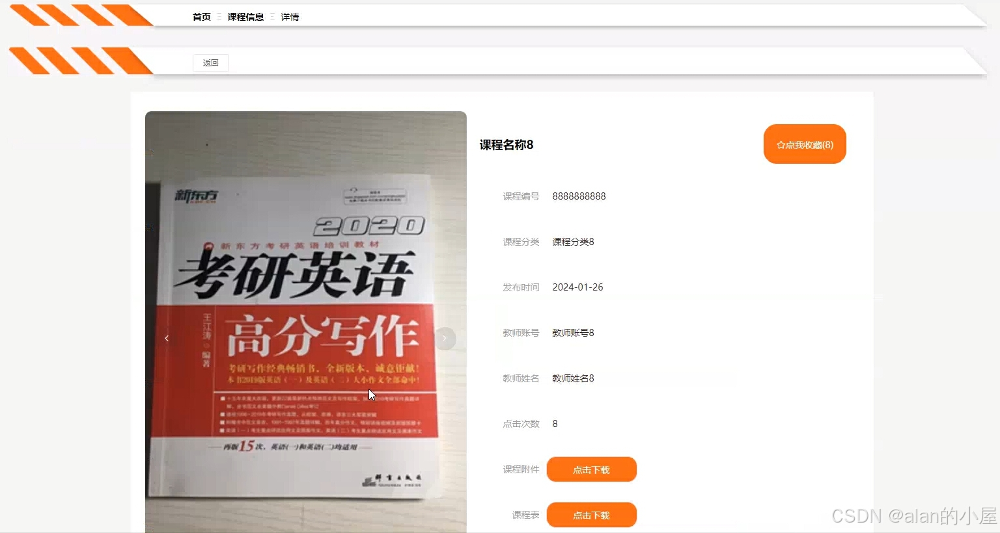
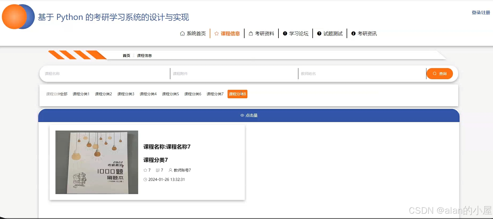
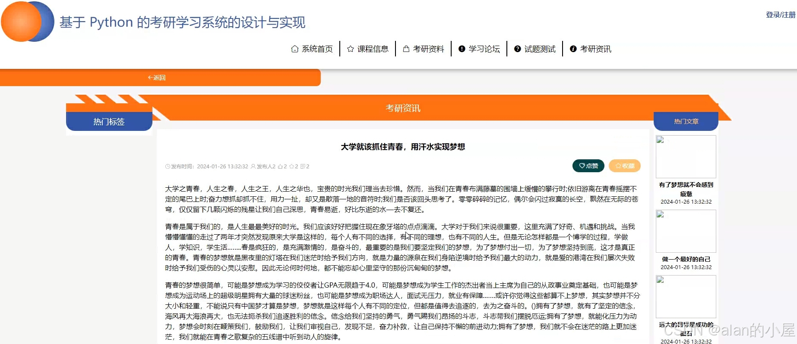
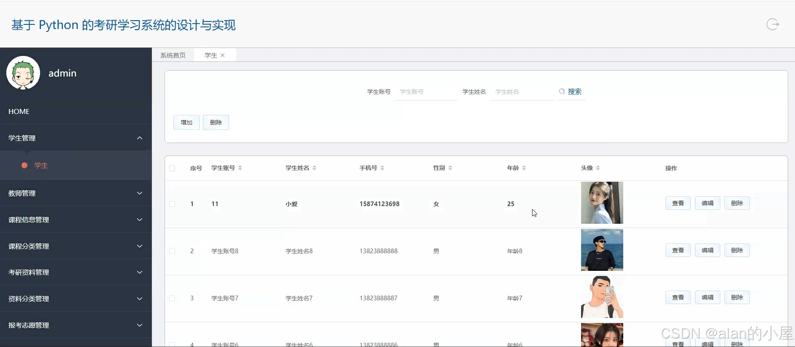

##  基于django的考研学习系统

##  介绍
👑本项目是基于Django框架✅✅是一个专为考研✅✅学生设计的综合平台，旨在提供丰富的学习资源和支持。该系统允许教师和教育机构发布各类考研课程，包括视频讲座、在线课程和模拟考试，帮助学生系统地掌握知识点。同时，平台也提供专业书籍的推荐与下载，涵盖各个科目和领域，以满足学生的学习需求。

## 运行环境
JAVA版本：JDK1.8 IDE类型：IDEA、Eclipse都可运行 数据库类型：MySql（8.x版本都可） 硬件环境：Windows

## 效果展示

## 源码获取 vx:  leealan289

